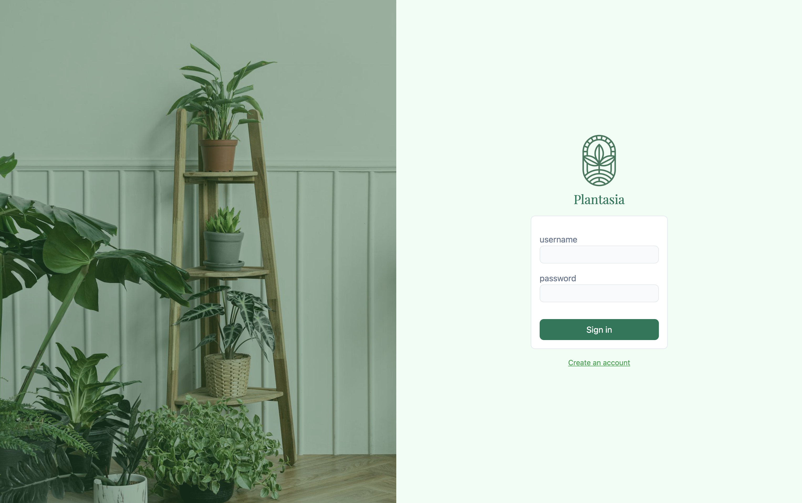
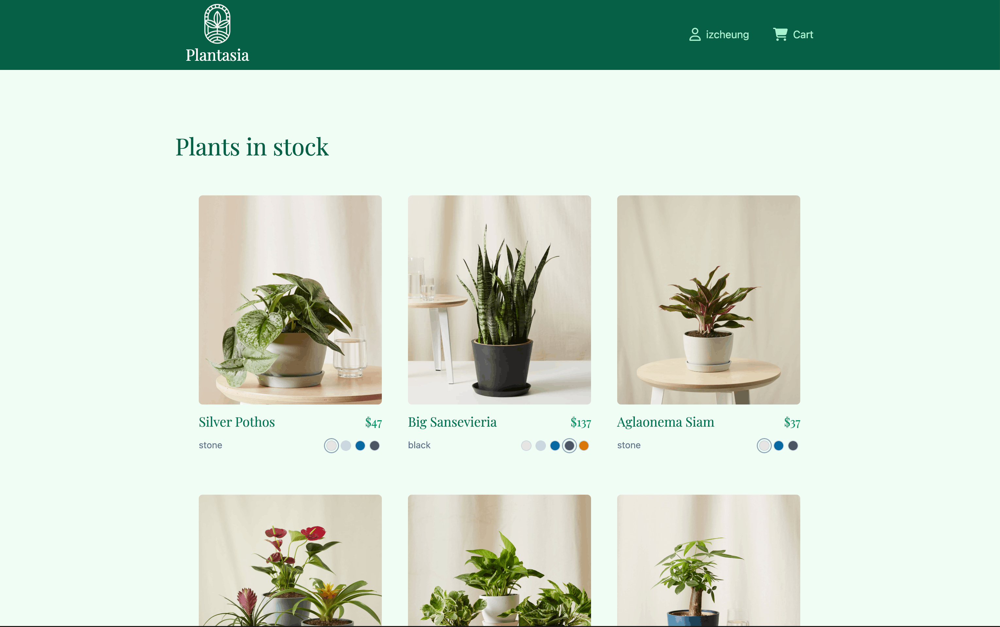
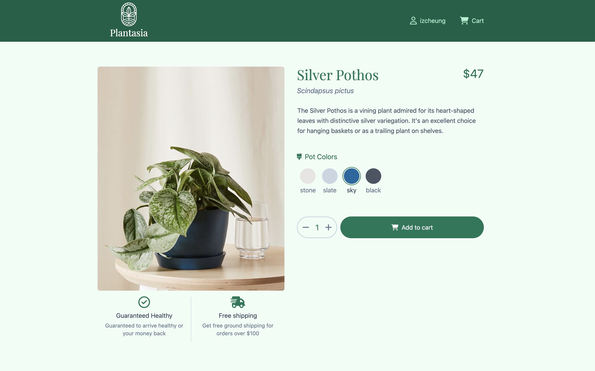
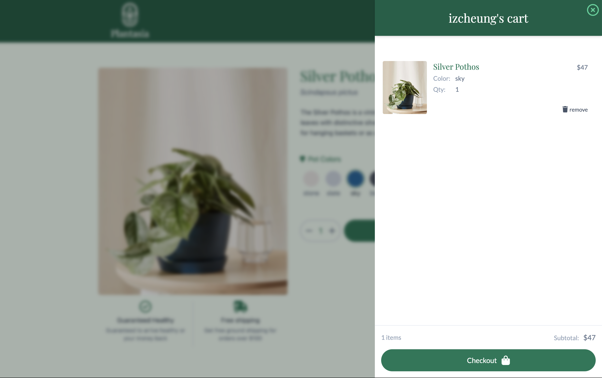

# Plantasia

## Mobile View


## Desktop View


## Table of Contents

1. [Summary](#summary)
2. [Motivation](#motivation)
3. [Requirements](#requirements)
4. [Tech Stack](#tech-stack)
5. [Quick Start](#quick-start)
6. [Features](#features)
7. [API Endpoints](#api-endpoints)
8. [Project Structure](#project-structure)
9. [Contributors](#contributors)
10. [Gallery](#gallery)

## Summary

Plantasia is a visually appealing, responsive React web application for a fictitious plant store. Built with modern frontend technologies, it features user authentication, plant browsing, detailed plant information, and a shopping cart system. The app provides a smooth, animated user experience with Tailwind CSS styling and is fully responsive for both desktop and mobile devices.

## Motivation

Plantasia was developed to demonstrate proficiency in modern React development, state management, and API integration. The project showcases skills in building responsive user interfaces, implementing authentication flows, and creating an engaging e-commerce experience with smooth animations and intuitive navigation.

## Requirements

- Node.js 18+ and npm
- An API endpoint configured with environment variables
- Environment variables: `VITE_API_BASE_URL` and `VITE_API_KEY`

## Tech Stack

- **Frontend**: React, React Router DOM, Vite
- **Styling**: Tailwind CSS, PostCSS
- **Animations**: Framer Motion
- **Authentication**: JWT (JSON Web Tokens) via `jwt-decode`
- **Build Tool**: Vite

## Quick Start

Clone the repository:

```bash
git clone https://github.com/izcheung/plantasia.git
cd plantasia
```

### Environment Setup

**⚠️ Note**: This application requires a private API key that is not publicly available. The API credentials cannot be obtained separately and are only available through the original source. Without these credentials, the application cannot be run.

For reference, the application expects the following environment variables (which are not available to the public):

```env
VITE_API_BASE_URL=your_api_base_url
VITE_API_KEY=your_api_key
```

### Installation and Development

Install dependencies:

```bash
npm install
```

Start the development server:

```bash
npm run dev
```

## Features

- **User Authentication**: Sign up and sign in functionality with JWT-based session management. Users must be authenticated to browse plants.

- **Plant Browsing**: Browse a curated collection of plants with beautiful card layouts. Each plant displays key information including name, price, and image.

- **Plant Details**: View detailed information about each plant including:

  - Plant benefits and care instructions
  - Multiple pot color options
  - High-quality images with zoom functionality
  - Add to cart functionality

- **Shopping Cart**:

  - Add plants to cart with selected pot colors and quantities
  - View cart items with real-time subtotal calculations
  - Remove items from cart
  - Persistent cart data via API

- **Responsive Design**: Fully responsive layout that works seamlessly on desktop, tablet, and mobile devices.

- **Smooth Animations**: Engaging user experience with Framer Motion animations for page transitions and component interactions.

## API Endpoints

The application integrates with the following API endpoints (configured via `VITE_API_BASE_URL`):

- **Authentication**

  - `POST /auth/signup` → Create new user account
  - `POST /auth/signin` → Authenticate user and receive JWT token

- **Plants**

  - `GET /plants` → Fetch list of all available plants
  - `GET /plants/:plantId` → Fetch detailed information for a specific plant

- **Cart**
  - `GET /cart` → Retrieve user's shopping cart
  - `POST /cart/plants/:plantId` → Add plant to cart with quantity and pot color
  - `DELETE /cart/:itemId` → Remove item from cart

All API requests include:

- `Authorization: Bearer {VITE_API_KEY}` header
- `Capstone-Session: {JWT_TOKEN}` header (when user is authenticated)

## Project Structure

```
.
├── public/                    # Static assets
├── src/
│   ├── assets/               # Project-specific assets (images, icons, etc.)
│   ├── context/
│   │   └── session.js        # Session context for user authentication state
│   ├── pages/
│   │   ├── auth/
│   │   │   ├── AuthForm/     # Reusable authentication form components
│   │   │   ├── SignIn.jsx    # Sign in page
│   │   │   └── SignUp.jsx    # Sign up page
│   │   └── plant/
│   │       ├── PlantItem.jsx # Plant card component for listings
│   │       ├── PlantList.jsx # Plant browsing page
│   │       └── plantDetails/ # Plant detail page components
│   ├── services/
│   │   ├── api.js            # API fetch utility with auth headers
│   │   ├── cart.js           # Cart service functions
│   │   ├── plants.js         # Plant service functions
│   │   └── user.js           # User authentication service
│   ├── shared/
│   │   ├── Navbar/           # Navigation bar with cart modal
│   │   │   └── modals/
│   │   │       └── CartModal/ # Shopping cart modal component
│   │   ├── LoadingSpinner.jsx
│   │   ├── RedirectToPlantsIfSignedIn.jsx
│   │   ├── RedirectToSignInIfSignedOut.jsx
│   │   ├── ScrollToTop.jsx
│   │   └── utils.js
│   ├── App.jsx               # Main app component with routing
│   ├── index.css             # Global styles
│   └── main.jsx              # React DOM render entry
├── eslint.config.js          # ESLint configuration
├── index.html
├── jsconfig.json             # JavaScript path aliases configuration
├── package.json
├── postcss.config.js         # PostCSS configuration
├── tailwind.config.js        # Tailwind CSS configuration
├── vite.config.js            # Vite build configuration
└── README.md
```

## Contributors

- Irene Cheung

## Gallery





